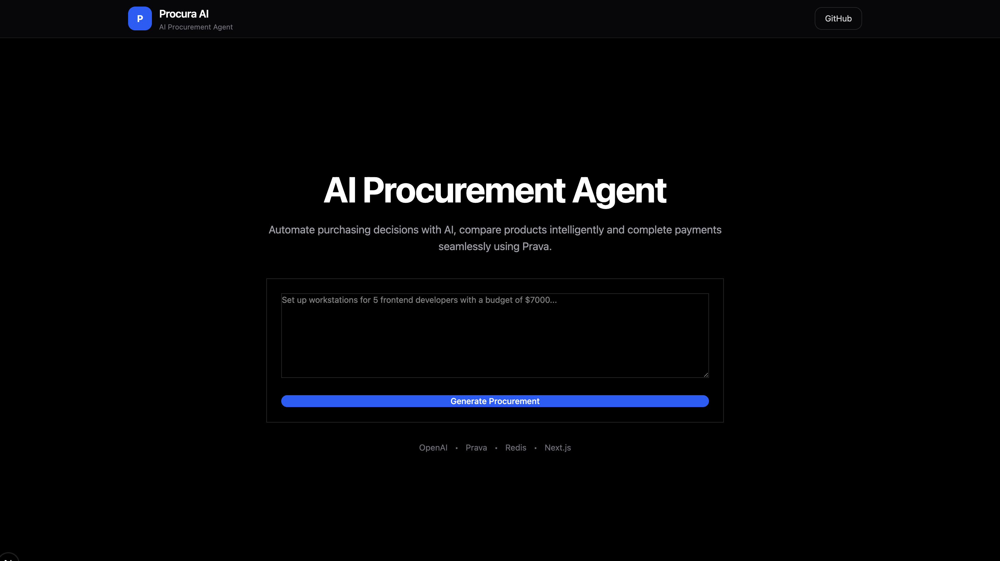

# 🚀 Procura AI

> AI-powered procurement agent that transforms natural language purchasing requests into optimized procurement plans, intelligent product bundles, AI reasoning, and secure payments.



## ✨ Features

- 🤖 AI-powered procurement planning
- 💰 Automatic budget allocation
- 🛒 Intelligent product bundle optimization
- 🧠 AI reasoning for every recommendation
- 💳 Secure checkout with Prava
- 📄 Receipt generation
- ⚡ Redis caching
- 🔥 Modern TurboRepo architecture

## 🏗️ Architecture

```text
Next.js
      │
      ▼
Express API
      │
      ├── OpenAI
      ├── Redis
      ├── Prava
      └── Product Catalog
```

## 🛠 Tech Stack

### Frontend

- Next.js 16
- React 19
- TypeScript
- Tailwind CSS v4

### Backend

- Express
- TypeScript
- Redis

### AI

- OpenAI Responses API

### Payments

- Prava SDK

### Monorepo

- TurboRepo
- PNPM Workspaces

## 📂 Project Structure

```text
apps/
│
├── api/
└── web/

packages/
│
├── ui/
├── eslint-config/
├── tailwind-config/
└── typescript-config/
```

## ⚙️ Local Setup

```bash
git clone https://github.com/as-ga/Procura-AI.git
cd Procura-AI
pnpm install
pnpm run dev
```

## Environment Variables

### API

```env
OPENAI_API_KEY=
REDIS_URL=
PRAVA_SECRET_KEY=
```

### WEB

```env
NEXT_PUBLIC_API_URL=
NEXT_PUBLIC_PRAVA_PUBLISHABLE_KEY=
```

## Demo Flow

```text
Landing
      ↓
AI Procurement
      ↓
Optimized Bundle
      ↓
Approve
      ↓
Prava Checkout
      ↓
Receipt
```

## Future Improvements

- Vendor marketplace integration
- Live price comparison
- Multi-vendor procurement
- Approval workflows
- PDF invoice generation

## License

MIT
